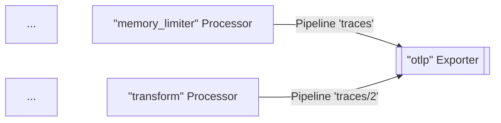
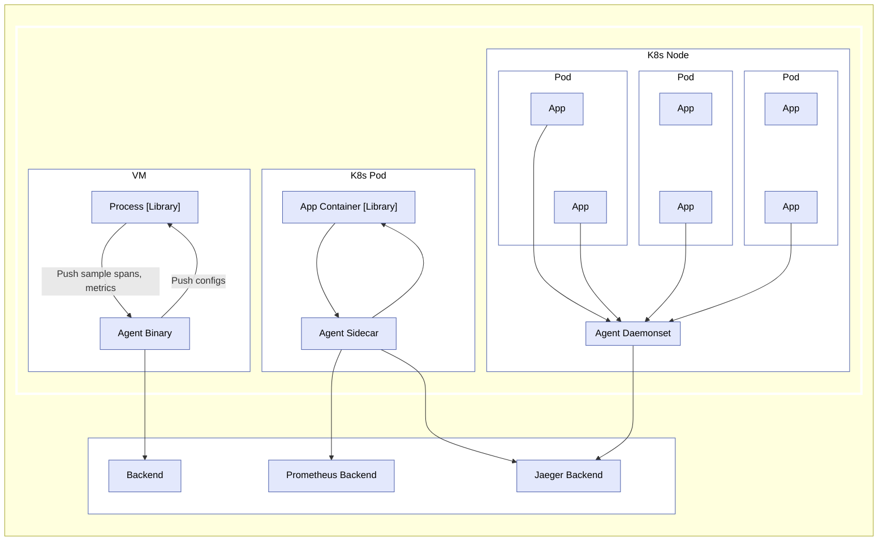
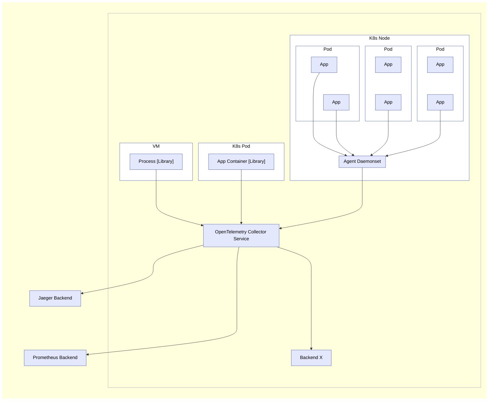

* OpenTelemetry Collector
  * == 💡executable file💡 /
    * receive telemetry,
      * supports MULTIPLE popular open source protocols
    * process telemetry,
    * export telemetry -- to -- MULTIPLE targets (_Example:_ observability backends)
      * supports MULTIPLE popular open source protocols
  * extensible architecture
    * == add MORE protocols
  * 's [pipelines](#pipelines)

## Pipelines

* responsible for
  * receive data
  * process data
  * export data
* MULTIPLE can be configured
* ==
  * [receiverS](#receivers)
    * collect the data
    * can be used | MULTIPLE pipelines
  * [processorS](#processors)
    * OPTIONAL
    * FIRST processor
      * 's input
        * ALL receiverS' data
    * ⚠️ALL processorS are sequential (!= parallel)⚠️
    * NON-FIRST NOR LAST processor
      * 's input
        * PREVIOUS processor's output data
      * 's output
        * sent -- to -- NEXT processor
    * LAST processor
      * 's output
        * sent -- , via `fanoutconsumer`, to -- MULTIPLE exporters
  * [exporterS](#exporters)
    * EACH one get the 👀LAST processor' copy of data👀
    * send it -- outside the -- Collector
    * can be used | MULTIPLE pipelines
* uses |
  * telemetry data types (traces, metrics, and logs)
    * ->
      * configure the pipeline
      * ⚠️receivers, processors, and exporters must support the telemetry data type⚠️
        * OTHERWISE, `pipeline.ErrSignalNotSupported` exception

* _Example:_

  ```mermaid
  ---
  title: Pipeline
  ---
  flowchart LR
    R1(Receiver 1) --> P1[Processor 1]
    R2(Receiver 2) --> P1
    RM(...) ~~~ P1
    RN(Receiver N) --> P1
    P1 --> P2[Processor 2]
    P2 --> PM[...]
    PM --> PN[Processor N]
    PN --> FO((fan-out))
    FO --> E1[[Exporter 1]]
    FO --> E2[[Exporter 2]]
    FO ~~~ EM[[...]]
    FO --> EN[[Exporter N]]
  ```

* constructed | Collector startup,
  * -- based on -- pipeline definition
    * _Example:_ pipeline configuration

      ```yaml
      service:
        pipelines: # == [pipeline]  == list of pipelineS
          traces: # telemetry data type -> type of the pipeline
            receivers: [otlp, zipkin]
            processors: [memory_limiter, batch]
            exporters: [otlp, zipkin]
      ```

### Receivers

* Receivers
  * listen | network port
  * can
    * receive telemetry data
    * actively obtain data (==scrapers)
  * 1 receiver can send the SAME received data -- to -- MULTIPLE pipelines
    * -> 👀create 1! receiver instance👀 | runtime / sends the data -- to a -- fan-out
      consumer
  * _Example:_

      ```yaml
      receivers:
      otlp:
          protocols:
          grpc:
              endpoint: localhost:4317

      service:
      pipelines:
          traces: # a pipeline of “traces” type
          receivers: [otlp]
          processors: [memory_limiter, batch]
          exporters: [otlp]
          traces/2: # another pipeline of “traces” type
          receivers: [otlp]
          processors: [transform]
          exporters: [otlp]
      ```

      ```mermaid
      flowchart LR
      R1("`#quot;opentelemetry-collector#quot; Receiver`") --> FO((fan-out))
      FO -->|Pipeline 'traces'| P1["`#quot;memory_limiter#quot; Processor`"]
      FO -->|Pipeline 'traces/2'| P2["`#quot;transform#quot; Processor`"]
      P1 ~~~ M1[...]
      P2 ~~~ M2[...]
      ```


* fan-out consumer
  * sends the data -- , ⚠️via synchronous function call⚠️, to -- EACH pipeline's FIRST processor
    * == pipeline1's processorX blocks pipeline2's processorS
    * -> receiver itself stops processing & forwarding newly received data

### Exporters

* Exporters
  * configuration
    * allows for
      * MULTIPLE exporters /
        * SAME type
        * | SAME pipeline
    * _Examples:_

      ```yaml
      exporters:
        otlp/1:
          endpoint: example.com:4317
        otlp/2:
          endpoint: localhost:14317
      ```

* TODO:
An exporter usually gets the data from one pipeline
However, you can configure multiple pipelines to send data to the same exporter:

```yaml
exporters:
  otlp:
    protocols:
      grpc:
        endpoint: localhost:14250

service:
  pipelines:
    traces: # a pipeline of “traces” type
      receivers: [zipkin]
      processors: [memory_limiter]
      exporters: [otlp]
    traces/2: # another pipeline of “traces” type
      receivers: [otlp]
      processors: [transform]
      exporters: [otlp]
```

In the above example, `otlp` exporter gets data from pipeline `traces` and from
pipeline `traces/2`
When the Collector loads this config, the result looks like
this diagram (part of processors and receivers are omitted for brevity):



### Processors

* Processors
  * BEFORE forwarding data,
    * can transform data
      * _Examples:_ adding or removing attributes | spans
    * can drop data (== NOT to forward it)
      * _Example:_ `probabilisticsampler` processor
    * can generate new data
  * uses
    * 👀| MULTIPLE pipelines👀
      * SAME configuration / EACH processor
      * 1 instance of the processor / EACH pipeline
        * -> OWN state
        * processors are NEVER shared BETWEEN pipelines


Note that each `batch` processor is an independent instance, although they are
configured the same way with a `send_batch_size` of `10000`.

> The same name of the processor must not be referenced multiple times in the
> `processors` key of a single pipeline.

## Running as an agent

On a typical VM/container, user applications are running in some processes/pods
with an OpenTelemetry library. Previously, the library did all the recording,
collecting, sampling, and aggregation of traces, metrics, and logs, and then
either exported the data to other persistent storage backends through the
library exporters, or displayed it on local zpages. This pattern has several
drawbacks, for example:

1. For each OpenTelemetry library, exporters and zpages must be re-implemented
   in native languages.
2. In some programming languages (for example, Ruby or PHP), it is difficult to
   do the stats aggregation in process.
3. To enable exporting of OpenTelemetry spans, stats, or metrics, application
   users need to manually add library exporters and redeploy their binaries.
   This is especially difficult when an incident has occurred, and users want to
   use OpenTelemetry to investigate the issue right away.
4. Application users need to take the responsibility for configuring and
   initializing exporters. These tasks are error-prone (for example, setting up
   incorrect credentials or monitored resources), and users may be reluctant to
   “pollute” their code with OpenTelemetry.

To resolve the issues above, you can run OpenTelemetry Collector as an agent.
The agent runs as a daemon in the VM/container and can be deployed independent
of the library. Once the agent is deployed and running, it should be able to
retrieve traces, metrics, and logs from the library, and export them to other
backends. We may also give the agent the ability to push configurations (such as
sampling probability) to the library. For those languages that cannot do stats
aggregation in process, they can send raw measurements and have the agent do the
aggregation.



> For developers and maintainers of other libraries: By adding specific
> receivers, you can configure an agent to accept traces, metrics, and logs from
> other tracing/monitoring libraries, such as Zipkin, Prometheus, etc. See
> [Receivers](#receivers) for details.

## Running as a gateway

The OpenTelemetry Collector can run as a gateway instance and receive spans and
metrics exported by one or more agents or libraries or by tasks/agents that emit
in one of the supported protocols. The Collector is configured to send data to
the configured exporter(s). The following figure summarizes the deployment
architecture:



The OpenTelemetry Collector can also be deployed in other configurations, such
as receiving data from other agents or clients in one of the formats supported
by its receivers.
