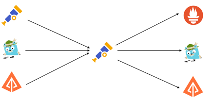

<!-- markdownlint-disable ol-prefix blanks-around-fences -->

* goal
  * about OpenTelemetry Collector,
    * set up & run
    * send telemetry & processed it -- by the -- Collector



## Prerequisites

- [Docker](https://www.docker.com/)
- [Go](https://go.dev/) v1.20+
- [`GOBIN` environment variable][gobin]
  ```sh
  export GOBIN=${GOBIN:-$(go env GOPATH)/bin}
  ```

## Set up the environment

* `docker pull otel/opentelemetry-collector-contrib`
* `go install github.com/open-telemetry/opentelemetry-collector-contrib/cmd/telemetrygen@latest`
  * install the [telemetrygen] utility
    * fake [traces], [metrics], and [logs]

## Generate and collect telemetry

* launch the Collector / listen | ports
  * 4317 -- for -- OTLP gRPC
  * 4318 -- for -- OTLP HTTP
  * 55679 -- for -- ZPages

     ```sh
     docker run \
       -p 127.0.0.1:4317:4317 \
       -p 127.0.0.1:4318:4318 \
       -p 127.0.0.1:55679:55679 \
       otel/opentelemetry-collector-contrib \
       2>&1 | tee collector-output.txt
        # tee
        #   OPTIONAL
        #   allows searching easier later
     ```

* generate sample
  * traces

     ```sh
     $GOBIN/telemetrygen traces --otlp-insecure --traces 3
     ```
    * check that traces were generated

     ```text
     2024-01-16T14:33:15.692-0500  INFO  traces/worker.go:99  traces generated  {"worker": 0, "traces": 3}
     2024-01-16T14:33:15.692-0500  INFO  traces/traces.go:58  stop the batch span processor
     ```
    * if you want to filter by relevant output

     ```sh
     $GOBIN/telemetrygen traces --otlp-insecure \
       --traces 3 2>&1 | grep -E 'start|traces|stop'
     ```
  * logs
    ```sh
    $GOBIN/telemetrygen logs --otlp-insecure --duration 5s
     ```
  * metrics
    ```sh
    $GOBIN/telemetrygen metrics --otlp-insecure --duration 5s
     ```

* | terminal window / run the Collector container,
  * look for trace ingest activity -- `Span #0`, `Span #1`, ... --

     ```console
     $ grep -E '^Span|(ID|Name|Kind|time|Status \w+)\s+:' ./collector-output.txt
     Span #0
         Trace ID       : f30faffbde5fcf71432f89da1bf7bc14
         Parent ID      : 6f1ff7f9cf4ec1c7
         ID             : 8d1e820c1ac57337
         Name           : okey-dokey
         Kind           : Server
         Start time     : 2024-01-16 14:13:54.585877 +0000 UTC
         End time       : 2024-01-16 14:13:54.586 +0000 UTC
         Status code    : Unset
         Status message :
     Span #1
         Trace ID       : f30faffbde5fcf71432f89da1bf7bc14
         Parent ID      :
         ID             : 6f1ff7f9cf4ec1c7
         Name           : lets-go
         Kind           : Client
         Start time     : 2024-01-16 14:13:54.585877 +0000 UTC
         End time       : 2024-01-16 14:13:54.586 +0000 UTC
         Status code    : Unset
         Status message :
     ...
     ```
* ZPages extension
  * http://localhost:55679/debug/pipelinez
  * http://localhost:55679/debug/tracez
    * select 1 samples

[gobin]: https://pkg.go.dev/cmd/go#hdr-Environment_variables
[logs]: /docs/concepts/signals/logs/
[metrics]: /docs/concepts/signals/metrics/
[telemetrygen]:
  https://github.com/open-telemetry/opentelemetry-collector-contrib/tree/main/cmd/telemetrygen
[traces]: /docs/concepts/signals/traces/
